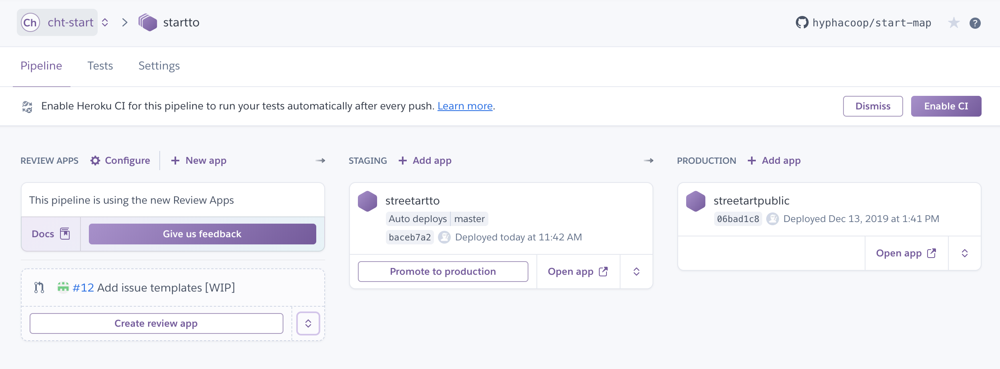

# StreetARToronto Map

An app for mapping Toronto street art projects.

This app is built in **ReactJS**, a javascript framework. We use the
**`create-react-app`** development framework to start with sensible defaults
and development practices that will be familiar to many familiar with ReactJS.

## :hammer_and_wrench: Technologies Used

- Development
  - [**Create React App.**][create-react-app] A development tool for easily bootstrapping and managing a ReactJS app with sensible defaults. 
  - [**Source Map Explorer.**][source-map-explorer] Analyze and debug JavaScript (or Sass or LESS) bloat in bundled code.
  - [**Heroku.**][heroku] Platform for easily deploying applications.
    - [**`create-react-app-buildpack`.**][create-react-app-buildpack] Heroku
      [buildpack][heroku-buildpack] for handling React apps like ours.
- App components
  - **Google Maps.**
    - [**Javascript API.**][gmaps-js] For customized maps on webpages.
  - **Javascript.**
    - [**Webpack.**][webpack] Static module bundler for modern JavaScript applications. (Hidden within `create-react-app`.)
    - [**React.**][react] A JavaScript library for building user interfaces.

   [create-react-app]: https://create-react-app.dev/
   [source-map-explorer]: https://github.com/danvk/source-map-explorer
   [heroku]: https://www.heroku.com/what
   [heroku-buildpack]: https://devcenter.heroku.com/articles/buildpacks
   [create-react-app-buildpack]: https://github.com/mars/create-react-app-buildpack

   [gmaps-js]: https://developers.google.com/maps/documentation/javascript/tutorial
   [webpack]: https://webpack.js.org/concepts/
   [react]: https://reactjs.org/

## :computer: Local Development

See also: Development Notes in [`DEVELOPMENT.md`](/DEVELOPMENT.md)

### Setup

```
npm install
```

### Available Scripts

#### `npm run analyze`

Runs `source-map-explorer` so that you can visualize what contributes to the size of your production build.

#### `npm start`

Runs the app in the development mode.<br />
Open [http://localhost:3000](http://localhost:3000) to view it in the browser.

The page will reload if you make edits.<br />
You will also see any lint (code style) errors in the console.

#### `npm test`

_**Note:** We are currently not writing tests, but plan to soon!_

Launches the test runner in the interactive watch mode.<br />

General `create-react-app` docs: See the section about [running tests](https://facebook.github.io/create-react-app/docs/running-tests) for more information.

#### `npm run build`

Builds the app for production to the `build` folder.<br />
It correctly bundles React in production mode and optimizes the build for the best performance.

The build is minified and the filenames include the hashes.<br />
Your app is ready to be deployed!

## Deployment

We use Heroku for deployment. You can see the deployment pipeline here:



We auto-deploy this GitHub repo to the staging environment.

Promoting the staging environment to production can be done via the Heroku interface on acceptance changes.

General `create-react-app` docs: See the section about [deployment](https://facebook.github.io/create-react-app/docs/deployment) for more information.

## :copyright: License
[MIT License](https://tldrlegal.com/license/mit-license)
